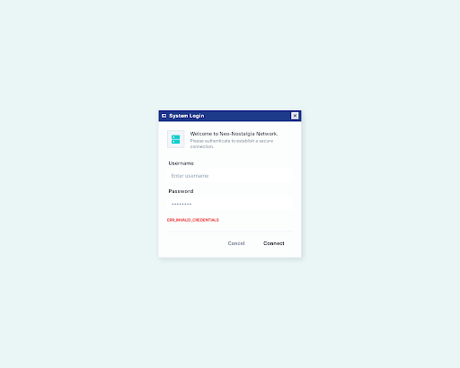
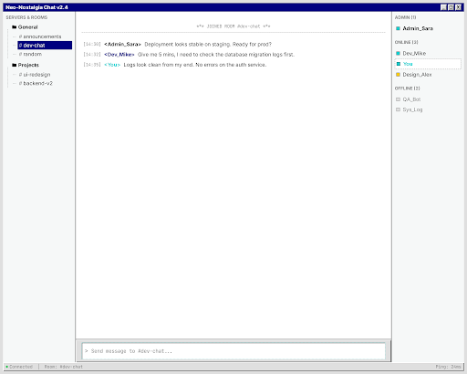
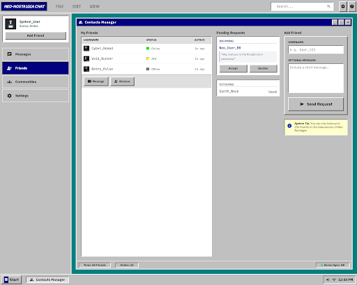

# ChatServer

> **A retro real-time chat application with a Win95 aesthetic — built for the DataArt Agentic AI Hackathon.**

---

## What is this?

ChatServer is a full-stack, real-time chat platform that looks like it escaped from 1995 but runs on modern async infrastructure. Think Windows 95 UI with WebSocket-powered presence, room management, and a full contacts/friends system underneath.

---

## Features

| Feature | Description |
|---|---|
| **Auth** | Register, login, session persistence across browser close |
| **Presence** | Live online / AFK / offline status via WebSocket — updates in < 2s |
| **Rooms** | Create, join, leave public/private rooms with member management and bans |
| **Messaging** | Real-time message delivery with file/image attachments |
| **Contacts** | Friend requests, accept/decline, remove, live presence on friend list |
| **Moderation** | Room-level bans with reason tracking |

---

## Stack

```
Backend   FastAPI + SQLAlchemy + SQLite + WebSockets
Frontend  Vanilla JS (ES modules) + Win95 CSS aesthetic
Infra     Docker Compose — two services, zero external dependencies
```

---

## Quickstart

```bash
# Clone and run
git clone https://github.com/jorgevaztdev/ChatServer.git
cd ChatServer

docker compose up --build
```

| Service | URL |
|---|---|
| Frontend | http://localhost |
| Backend API | http://localhost:8000 |
| API Docs | http://localhost:8000/docs |

---

## Project Structure

```
ChatServer/
├── backend/
│   ├── src/
│   │   ├── api/          # REST endpoints (auth, rooms, messages, friends, bans, ws)
│   │   ├── models/       # SQLAlchemy models
│   │   └── services/     # Auth, presence, messaging, WebSocket hub
│   └── tests/
│       └── integration/  # 83 integration tests — all green
├── frontend/
│   └── src/
│       ├── components/   # JS components (room list, message list, friend list, presence dot)
│       └── pages/        # HTML pages (login, register, chat, contacts, room catalog)
├── screens/              # UI mockups (reference designs)
└── docker-compose.yml
```

---

## API Overview

```
POST   /auth/register          Register new user
POST   /auth/login             Login, get session cookie
POST   /auth/logout            Logout current session
GET    /auth/me                Current user info

WS     /ws                     WebSocket — presence + messaging hub

GET    /rooms                  List rooms
POST   /rooms                  Create room
POST   /rooms/{id}/join        Join room
POST   /rooms/{id}/leave       Leave room
GET    /rooms/{id}/messages    Fetch message history

POST   /friends/request        Send friend request
POST   /friends/accept/{id}    Accept request
DELETE /friends/decline/{id}   Decline request
DELETE /friends/{id}           Remove friend
GET    /friends                List friends with live presence
GET    /friends/requests       Pending incoming requests

POST   /bans                   Ban user from room
DELETE /bans/{id}              Unban user
GET    /rooms/{id}/bans        List bans for room
```

---

## Running Tests

```bash
cd backend
DATABASE_URL="sqlite:///./test_chat.db" python3 -m pytest tests/integration/ -v
# 83 passed
```

---

## Screenshots

<table>
  <tr>
    <td></td>
    <td></td>
    <td></td>
  </tr>
  <tr>
    <td align="center">Login</td>
    <td align="center">Main Chat</td>
    <td align="center">Contacts</td>
  </tr>
</table>

---

## Built with

- [FastAPI](https://fastapi.tiangolo.com/)
- [SQLAlchemy](https://www.sqlalchemy.org/)
- [Starlette WebSockets](https://www.starlette.io/websockets/)
- Vanilla JS — no framework, no build step
- Docker Compose

---

*DataArt Agentic AI Hackathon — 2026*
